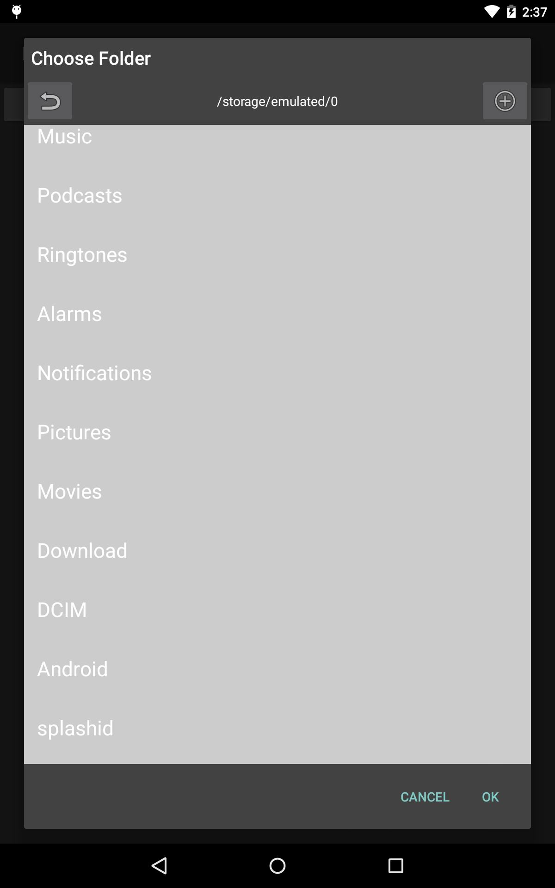

# Android-FolderPicker
A folder chooser library for android

A simple folder chooser anyone can integrate into their Android app.

Pros
- Light weight
- Doesn't need any layout file. View is created dynamically
- Data returned using convention used by Android.
- Can be customized to match the theme
- Requires Android v11+ to work.

#Usage

For a full example see the `SampleActivity` in the
[repository](https://github.com/ndhunju/Android-FolderPicker/blob/master/src/main/java/ndhunju/com/folderpicker/SampleActivity.java).

To:Do

1.In Manifest

Request the
`android.permission.WRITE_EXTERNAL_STORAGE` permission.

```xml
<uses-permission android:name="android.permission.WRITE_EXTERNAL_STORAGE" />
<uses-permission android:name="android.permission.READ_EXTERNAL_STORAGE" />
```

2.In Activity/Fragment

- Get an instance of the fragment:

```java

//Show the FolderPickerDialog
FolderPickerDialogFragment fpdf = FolderPickerDialogFragment
                .newInstance(INIT_DIRECTORY, REQUEST_CODE_DIR);
fpdf.show(getFragmentManager(), TAG);

```

- Handle the result,
(Your Acitivity or Fragment must implement OnDialogBtnClickedListener.java)
```java
@Override
public void onDialogBtnClicked(Intent data, int whichBtn, int result, int requestCode) {
  switch(requestCode){
    case REQUEST_CODE_DIR:
      if(result != Activity.RESULT_OK)
        return;
      //Get the selected folder path through intent
      String selectedFolderDir = data
                        .getStringExtra(FolderPickerDialogFragment.KEY_CURRENT_DIR);
      Toast.makeText(getBaseContext(), selectedFolderDir, Toast.LENGTH_LONG).show();
      break;
    }
  }
```

<table>
<tr>
<th>As DialogFragment<br></th>
</tr>
</table>
